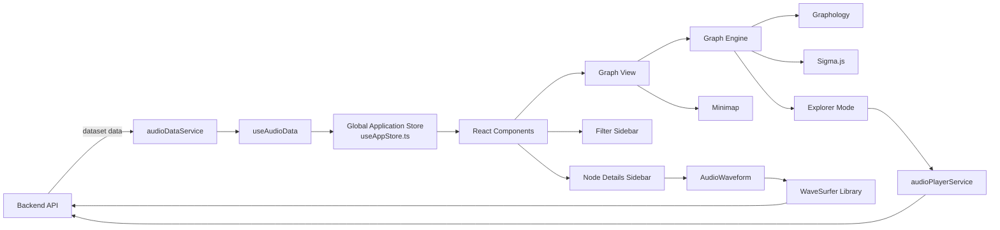

# Audio Explorer

Software to display and interactively explore large audio datasets.

## Requirements

- Node.js
- npm
- Running Audio Explorer backend

## Setup

Clone the repository and install the dependencies:

```bash
git clone <repository-url>
cd audioexplorer-frontend
npm install
```

Place a `data/` folder containing all audio files one level above this directory (i.e. at `../data/`).

## Run

```bash
npm run dev
```

## Usage

The application visualizes audio samples as nodes in an interactive graph

Users can:

- navigate and zoom through the graph
- select nodes to inspect audio samples
- preview audio in Explorer Mode and play by hovering
- play the selected sample
- view the waveform of the selected audio
- filter categorized and uncategorized samples
- filter individual categories
- categorize audio samples
- access project information on the About page

## Developer Documentation

For local development, setup instructions, and commands that mirror the CI pipeline, see:

- [Local Development Guide](Local_Command_README.md)

## Architecture

The frontend is built with **React** and **TypeScript**.

- **Sigma.js** renders the interactive graph.
- **Graphology** manages the underlying graph data structure.
- **WaveSurfer.js** provides waveform visualization and audio playback.
- **Zustand** manages the shared application state.
- Dedicated services communicate with the backend to load datasets and audio files.



## Central Modules

### Data Loading

`useAudioData.ts` loads datasets from the backend via `audioDataService.ts` and stores the returned data in the global application store.

---

### State Management

Shared application state is managed using Zustand in `useAppStore.ts`

The store contains:

- loaded dataset
- filtered dataset
- selected node
- graph settings
- filter sidebar state
- filter configuration

Whenever filters change, the visible dataset is recalculated automatically

### Graph Engine

The graph visualization is separated from the React components by a graph engine

- `GraphEngine.ts` defines the graph engine interface
- `SigmaEngineAdapter.ts` implements the interface using Sigma.js
- `useGraphEngine.ts` creates the graph and handles graph interactions

### Explorer Mode

Explorer Mode allows users to preview audio samples directly while hovering over graph nodes.

Audio playback starts after a short delay and stops automatically when leaving the node or disabling Explorer Mode.

---

### Filters

`FilterSidebar.tsx` provides filtering by:

- categorized samples
- uncategorized samples
- individual categories

It also includes category counts and a searchable category list.

---

### Tooltip

`NodeTooltip.tsx` displays the category of the hovered or selected node.

Its position is updated automatically while navigating through the graph.

---

### Minimap

The minimap provides an overview of the complete graph.

Users can click inside the minimap to move in the graph.

---

### Audio Playback

Audio playback is divided into two components.

- `AudioWaveform.tsx` uses **WaveSurfer.js** to display and play the selected audio sample.
- `audioPlayerService.ts` provides shared playback functionality for graph interactions such as Explorer Mode.

---

### General Components

- `GraphView.tsx` contains the main graph visualization and connects the graph engine with the application state.
- `Header.tsx` and `Footer.tsx` contains the page layout for header and footer.
- `AboutPage.tsx` contains information about the Audio Explorer project.

---

### Styling

Styling is organized into component-specific and shared CSS files.

- Component styles are stored next to their React components.
- `styles/variables.css` contains shared CSS variables.
- `styles/layout.css` contains global layout rules.
- `styles/shared-sidebar.css` contains reusable sidebar styles.

---

## How to Contribute

1. Update the local `main` branch.

```bash
git switch main
git pull
```

2. Create a new branch.

```bash
git switch -c feature/short-description
```

Recommended branch prefixes:

```text
feature/
fix/
docs/
refactor/
```

3. Implement and test your changes.

4. Run the formatting, linting and build commands.

5. Commit and push your changes.

```bash
git add .
git commit -m "Describe the change"
git push --set-upstream origin <branch-name>
```

6. Create a pull request describing the implemented changes.

Recent Frontend Enhancements

Developed by Shermineh Shasti

Significant improvements have been implemented in the frontend to enhance data management, user experience, and visualization accuracy.
1. Core Features

   Anomaly Detection: Designed and implemented the AnomalyPopup panel to visualize statistical analysis results (Isolation Forest and Local Outlier Factor) alongside score distributions.

   Bulk Data Management (BulkActionBar): Added "Select All", "Delete All", and "Export CSV" functionalities with real-time synchronization via useAppStore.

   Advanced Audio Metadata Panel: Created AdvancedAudioMetadataPanel to display precise technical data (sampling rate, exact duration), waveform visualization, and quick metadata copying.

   Interactive Controls: Introduced control sliders for dynamic node scaling and advanced graph navigation tools.

2. UI/UX & Visual Improvements

   Color & Cluster Engineering: Refactored clusters.ts and expanded the color palette from 8 to 43 distinct colors, dramatically improving graph readability and aesthetics.

   Loading Experience: Implemented a dedicated LoadingScreen with an integrated audio wave animation for professional handling of large datasets.

   UI Layout: Completely redesigned the Header, Footer, and AboutPage alongside adding a Dark/Light mode toggle.

   Explorer Mode: Optimized for user focus on the audio map with improved selection-clearing logic and hover-playback.